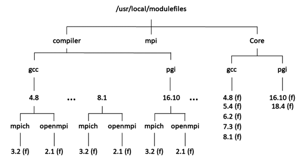
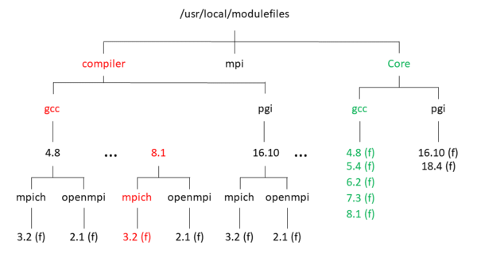

Absolutely, let's delve deeper into the spellbook of HPC module files and uncover the mysteries within!

**Q1: How do module files improve efficiency for users new to the HPC environment?**

Module files, like spells for the modern wizard, drastically improve efficiency by abstracting the complexity of software environments. Imagine you're a culinary novice tasked with preparing a gourmet meal. The kitchen is vast, with ingredients and utensils spread across countless cabinets and drawers. Without guidance, you'd spend hours searching for the right tools and components. Module files are your magical cookbook: with a simple command, the exact spices, pans, and ingredients appear at your workstation, ready to use. For newcomers to HPC, this means no longer wading through the murky waters of software dependencies or environment settings. Instead, they can focus on their computational research or tasks, confident that the foundation of their work is solid and error-free.

**Q2: Can you share some examples of complex software environments where LMOD particularly shines over traditional Environment Modules?**

In the vast universe of software, some galaxies are known for their complexity and intricacy. One such galaxy is the realm of bioinformatics, where tools like BLAST, Bowtie, and GATK coexist with countless others, each requiring specific versions of dependencies like Perl, Python, or Java. LMOD shines brightly here, managing these intricate dependencies with the grace of a seasoned librarian. It ensures that users can switch between different versions of software and their dependencies without causing a collapse in the space-time continuum of their work environment. Another domain is machine learning, where frameworks like TensorFlow, PyTorch, and CUDA demand precise orchestration. LMOD's ability to manage module hierarchies ensures that users can experiment with different versions seamlessly, fostering an environment of innovation and discovery.

**Q3: Beyond software management, what are some advanced features of LMOD that can further enhance productivity in HPC tasks?**

LMOD is not just a tool; it's a wizard's apprentice, learning and adapting to enhance your productivity. One of its advanced spells is the module spider command, a magical search tool that scours the library of modules to find exactly what you need, even if you don't know the exact name or version. It's like having a crystal ball that shows you where to find the rarest of ingredients for your spells. Then, there's the ability to save and restore module collections, allowing users to set up their environment once and then summon it with a word, across sessions and even different machines. This is akin to bookmarking dimensions in a portal book, allowing for instantaneous travel back to a setup that worked perfectly. Lastly, LMOD's integration with job scheduling systems means that the right environment can automatically be conjured up when a job runs, ensuring that each task has the right computational environment without manual intervention. This is like setting magical traps that, when triggered, automatically create the perfect conditions for your experiments or computations.

---

## Environment Modules Using Lmod
### Lmod Hierarchical Modules
--- 

One of the key capabilities of Lmod is module hierarchy. Using this capability, Lmod does not let you see or load modules according to the modules that are currently loaded, which helps prevent the loading of conflicting modules, resulting in problems. It can also help you understand what combinations of modules are available, because admins might not build every possible combination. However, if you want to see all possible modules, the Lmod module spider command lets you see all modules.



Figure 1 illustrates the module hierarchy of the module files on my laptop. Anything marked (f) is a file. Everything else is a directory. At the top of the diagram, /usr/local/modulefiles is the directory where all module files are stored. This is the default for Lmod, which is fine for single systems. For clusters, the directory /usr/local would need to be NFS-exported to all of the compute nodes, or you could install Lmod to a different NFS-exported directory.
Figure 1: Example module file layout.

Below the root directory are three main subdirectories: Core, compiler, and mpi. These directories indicate the dependencies of the various modules. For example, everything in the compiler directory depends on a specific compiler (e.g., GCC 8.1). Everything in the mpi directory is dependent on a specific MPI and compiler combination. Everything in the Core directory does not depend on anything except the operating system.

By default, Lmod reads module files in /usr/local/modulefiles/Core as the first level of available modules. It is a best practice to put any module files in this directory that do not depend on either a compiler or an MPI library, which means you also put the compiler module files in the Core directory.

The gcc subdirectory under Core is where all of the module files for the GNU family of compilers are stored. A best practice from the developer of Lmod, Robert McLay at the University of Texas Advanced Computing Center (TACC), is to make all subdirectories beneath Core, compiler, and mpi lowercase. In McLay’s own words, “Lmod is designed to be easy to use interactively and be easy to type. So I like lower case names where ever possible.” He continues: “I know of some sites that try very hard to match the case of the software: Open MPI, PETSc, etc. All I can say is that I’m glad I don’t have to work on those systems.”

The gcc subdirectory has a module file named 8.1, and you will have a module file corresponding to every GCC compiler version that you want to expose to users. (You could hide some versions from users by not having a module file for it.) For example, if you have versions 5.1, 6.2, 7.1, and 8.1 of the GCC compilers, then you should have four module files in /usr/local/modulefiles/Core/gcc corresponding to these versions. In the case of GCC version 8.1, as shown In Figure 1, the module file 8.1 (f) is actually 8.1.lua, which contains the details for version 8.1 of the GNU compilers. The extension .lua, although not shown in Figure 1, indicates that the module file is written in Lua; however, it could be written in Tcl and called 8.1.tcl.

Notice that for a different set of compilers (e.g., those from PGI), you would create a directory named pgi under /usr/local/modulefiles/Core and then place the module files corresponding to the specific PGI compiler versions in this subdirectory.

All Lmod commands start with module followed by options. For example, you can find what modules are available with the module avail option (Listing 1).

Listing 1: module avail Command

$ module avail
 
--------------------- /usr/local/modulefiles/Core ----------------------
   gcc/6.2    gcc/7.1    gcc/8.1 (D)    pgi/16.10    pgi/18.4 (D)
 
---------------- /usr/local/lmod/lmod/modulefiles/Core -----------------
   lmod/6.5    settarg/6.5
 
  Where:
   D:  Default Module
 
Use "module spider" to find all possible modules.
Use "module keyword key1 key2 ..." to search for all possible modules
matching any of the "keys".

Notice that compiler modules are “available” to be loaded because they are “visible.” If you load the gcc/8.1 module and and use module list,

$ module load gcc/8.1
$ module list
 
Currently Loaded Modules:
  1) gcc/8.1

you will see that the GCC 8.1 compiler is loaded.

The compiler module files modify the Lmod environment variables to point to the appropriate compiler. It also uses some commands to tell Lmod what MPI libraries are available that have been built with the loaded compiler. Therefore, only the MPI tools that depend on the loaded compiler are available to the user.

If you now type module avail, you get the response shown in Listing 2. Notice the two subdirectories under /usr/local/modulefiles/compiler, one for each compiler “family.” Under the GCC compiler family is another subdirectory for each version of the GCC compiler that have modules. In this case, it is version 8.1 only.

Listing 2: Viewing Loaded MICH Module

$ module avail
 
--------------- /usr/local/modulefiles/compiler/gcc/8.1 ----------------
   mpich/3.2    openmpi/3.1
 
--------------------- /usr/local/modulefiles/Core ----------------------
   gcc/6.2    gcc/7.1    gcc/8.1 (L,D)    pgi/16.10    pgi/18.4 (D)
 
---------------- /usr/local/lmod/lmod/modulefiles/Core -----------------
   lmod/6.5    settarg/6.5
 
  Where:
   L:  Module is loaded
   D:  Default Module
 
Use "module spider" to find all possible modules.
Use "module keyword key1 key2 ..." to search for all possible modules
matching any of the "keys".

Under that subdirectory lie all applications dependent on the GCC 8.1 compiler. For example, Figure 1 shows two MPI library families, mpich and openmpi. Under these directories are the module files corresponding to the specific MPI library version. These modules are denoted with an (f) next to their name.

Try loading an MPI module to see how Lmod “screens out” modules that are not compatible with the loaded modules. The command module avail lists the modules that are available; however, Lmod is smart enough to show only the modules that are available on the basis of currently loaded modules. For example, you can load the mpich/3.2 modules and then module list the currently loaded modules.

Loading the mpich/3.2 module should modify the $PATH, $LD_LIBRARY_PATH, and $MANPATH environment variables, as well as add some environment variables specific to MPICH, which you can check by looking at the paths to the mpicc and mpif77 scripts (Listing 3). Notice that mpicc and mpif77 point to the correct scripts (you can tell by the path).

Listing 3: module list Command

$ module load mpich/3.2
$ module list
 
Currently Loaded Modules:
  1) gcc/8.1   2) mpich/3.2
 
$ which mpicc
~/bin/gcc-8.1-mpich-3.2.1/bin/mpicc
$ which mpif77
~/bin/gcc-8.1-mpich-3.2.1/bin/mpif77

An important key to making everything work correctly is in the module files. I will take a deeper look at these module files for a better understanding.
Under the Module File Hood

Everything works just great with Lmod so far. Modules can be loaded, unloaded, deleted, purged, and so on. however, without good module files, Lmod would execute whatever commands you put in the file, which could cause problems. To understand what is happening with module files, the GCC 8.1 compiler module (it, too, is written in Lua) is shown in Listing 4.

Listing 4: GCC 8.1 Compiler Module

-- -*- lua -*-
------------------------------------------------------------------------
-- GCC 8.1 compilers - gcc, g++, and gfortran. (Version 8.1)
------------------------------------------------------------------------
 
 
help(
[[
This module loads the gcc-8.1.0 compilers (8.1.0). The 
following additional environment variables are defined:
 
CC   (path to gcc compiler wrapper      )
CXX  (path to g++ compiler wrapper      )
F77  (path to gfortran compiler wrapper )
F90  (path to gfortran compiler wrapper )
FC   (path to gfortran compiler wrapper )
 
See the man pages for gcc, g++, gfortran (f77, f90). For 
more detailed information on available compiler options and 
command-line syntax.
]])     
 
 
-- Local variables
local version = "8.1"
local base = "/home/laytonjb/bin/gcc-8.1.0/"
 
 
-- Whatis description
whatis("Description: GCC 8.1.0 compilers")
whatis("URL: www.gnu.org")
 
 
-- Take care of $PATH, $LD_LIBRARY_PATH, $MANPATH
prepend_path("PATH", pathJoin(base,"bin"))
prepend_path("PATH", pathJoin(base,"sbin"))
prepend_path("PATH", pathJoin(base,"include"))
prepend_path("LD_LIBRARY_PATH", pathJoin(base,"lib"))
prepend_path("LD_LIBRARY_PATH", pathJoin(base,"lib64"))
prepend_path("MANPATH", pathJoin(base,"share/man"))
 
 
-- Environment Variables
pushenv("CC", pathJoin(base,"bin","gcc"))
pushenv("CXX", pathJoin(base,"bin","g++"))
pushenv("F77", pathJoin(base,"bin","gfortran"))
pushenv("FORT", pathJoin(base,"bin","gfortran"))
pushenv("cc", pathJoin(base,"bin","gcc"))
pushenv("cxx", pathJoin(base,"bin","g++"))
pushenv("f77", pathJoin(base,"bin","gfortran"))
pushenv("fort", pathJoin(base,"bin","gfortran"))
pushenv("FC", pathJoin(base,"bin","gfortran"))
pushenv("fc", pathJoin(base,"bin","gfortran"))
 
-- Setup Modulepath for packages built by this compiler
local mroot = os.getenv("MODULEPATH_ROOT")
local mdir = pathJoin(mroot,"compiler/gcc", version)
prepend_path("MODULEPATH", mdir)
 
 
-- Set family for this module
family("compiler")

The GNU 8.1 compilers were installed in my home directory on my laptop, so I am not too worried about where exactly the compilers are installed. However, for clusters, I would install them on an NFS-shared filesystem, such as /usr/local/ or /opt/. Installing them individually on each node is ripe for problems.

The module file can be broken down into several sections. The first part of the file is the help function, which is printed to stdout when you ask for module help. The next section defines the major environment variables $PATH, $LD_LIBRARY_PATH, and $MANPATH. Notice that the function prepend_path is used to put the compiler “first” in these environment variables.

The third major section of the module file is where the specific environment variables for the compiler are defined. For this module, the variables are pretty straightforward: CC, cc, f77, F77, and so on. These variables are specific to the compiler and are defined with the pushenv function, which pushes the variables into the environment. It also uses the pathJoin function, which helps creates the correct paths for these variables.

The last section is key to Lmod, with the definition of two environment variables: $MODULEPATH and $MODULEPATH_ROOT. The line

local mdir = pathJoin(mroot,"compiler/gcc", version)

creates a local variable named mdir, which is a concatenation of the mroot variable ($MODULEPATH_ROOT) and compiler/gcc. It tells Lmod that subsequent module avail commands should look at the compiler/gcc subdirectory under the main module directory corresponding to the compilers just loaded (gcc/8.1). As the writer of the modules, you control where the module files that depend on the compilers are located. This step is the key to module hierarchy. You can control what modules are subsequently available by manipulating the mdir variable. This Lmod attribute gives you great flexibility.

The very last line in the module file, the statement family("compiler"), although optional, simplifies everything for users (i.e., it is a best practice). The function family tells Lmod to which family the module belongs. A user can only have one module per family loaded at a time. In this case, the family is compiler, so that means no other compilers can be loaded. (You would hope all other compiler modules also use this family statement.) Adding this line helps users prevent self-inflicted problems. Even though the statement is somewhat optional, I highly recommend using it.

If the GCC 8.1 compiler is loaded, then the diagram of the module layout should look something like Figure 2. The green labels indicate the compiler module that is loaded. The red labels indicate the path to the modules that depend on it (the MPI modules). Note that the MPI modules are under the compiler directory because they depend on the compiler module that is loaded.



Figure 2: Active path after gcc/8.1 is loaded.

In the previous section, I loaded the mpich/3.2 module associated with the GCC 8.1 compiler. Listing 5 for the mpich/3.2 module file was built with the GCC 8.1 compiler.

Listing 5: MPICH 3.2 Module File

```lua
-- -*- lua -*-
------------------------------------------------------------------------
-- mpich-3.2 (3.2.1) support. Built with gcc-8.1 (8.1.0)
------------------------------------------------------------------------
 
 
help(
[[
This module loads the mpich-3.2 MPI library built with gcc-8.1.
compilers (8.1.0). It updates the PATH, LD_LIBRARY_PATH, 
and MANPATH environment variables to access the tools for
building MPI applications using MPICH, libraries, and
available man pages, respectively.
 
This was built using the GCC compilers, version 8.1.0.
 
The following additional environment variables are also defined:
 
MPICC   (path to mpicc compiler wrapper   )
MPICXX  (path to mpicxx compiler wrapper  )
MPIF77  (path to mpif77 compiler wrapper  )
MPIF90  (path to mpif90 compiler wrapper  )
MPIFORT (path to mpifort compiler wrapper )
 
See the man pages for mpicc, mpicxx, mpif77, and mpif90. For 
more detailed information on available compiler options and 
command-line syntax. Also see the man pages for mpirun or
mpiexec on executing MPI applications.
]]) 
```    
 

```lua
-- Local variables
local version = "3.2"
local base = "/home/laytonjb/bin/gcc-8.1-mpich-3.2.1" 
 
-- Whatis description
whatis("Description: MPICH-3.2 with GNU 8.1 compilers")
whatis("URL: www.mpich.org")
 
 
-- Take care of $PATH, $LD_LIBRARY_PATH, $MANPATH
prepend_path("PATH", pathJoin(base,"bin"))
prepend_path("PATH", pathJoin(base,"include"))
prepend_path("LD_LIBRARY_PATH", pathJoin(base,"lib"))
prepend_path("MANPATH", pathJoin(base,"share/man"))
 
 
-- Environment Variables
pushenv("MPICC", pathJoin(base,"bin","mpicc"))
pushenv("MPICXX", pathJoin(base,"bin","mpic++"))
pushenv("MPIF90", pathJoin(base,"bin","mpif90"))
pushenv("MPIF77", pathJoin(base,"bin","mpif77"))
pushenv("MPIFORT", pathJoin(base,"bin","mpifort"))
pushenv("mpicc", pathJoin(base,"bin","mpicc"))
pushenv("mpicxx", pathJoin(base,"bin","mpic++"))
pushenv("mpif90", pathJoin(base,"bin","mpif90"))
pushenv("mpif77", pathJoin(base,"bin","mpif77"))
pushenv("mpifort", pathJoin(base,"bin","mpifort"))
 
 
-- Setup Modulepath for packages built by this compiler/mpi
local mroot = os.getenv("MODULEPATH_ROOT")
local mdir = pathJoin(mroot,"mpi/gcc", "8.1","mpich","3.2")
prepend_path("MODULEPATH", mdir)
 
 
-- Set family for this module (mpi)
family("mpi")
```

If you compare this module file to the compiler module file, you will see many similarities. The classic environment variables, $PATH, $LD_LIBRARY_PATH, and $MANPATH, are modified and certain environment variables are defined. Because you want the MPI tools that are associated with the module to be “first” in $PATH, the Lmod module command prepend_path is used again.

Toward the end of the file, examine the code for Modulepath. The local variable mdir points to the “new” module subdirectory, which is mpi/gcc/8.1/mpich/3.2. (Technically, the full path is /usr/local/modulefiles/mpi/gcc/8.1/mpich/3.2 because $MODULEPATH_ROOT is /usr/local/modulefiles.) In this subdirectory, you should place all modules that point to tools that have been built with both the gcc/8.1 compilers and the mpich/3.2 tools. Examples of module files that depend on both a compiler and an MPI tool are applications or libraries such as PETSc. Although not shown here, it is not too difficult to extend the MPI module file to depend on both a compiler and an MPI library.

Also notice that the mpich/3.2 module uses the family() function so that the user cannot load a second MPI module. You could even have a family() function for libraries such as PETSc.

